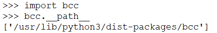
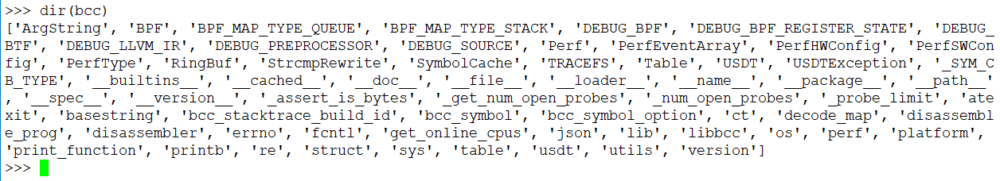
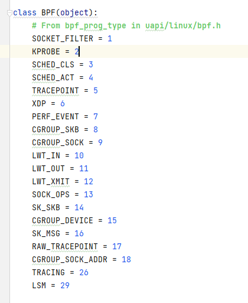
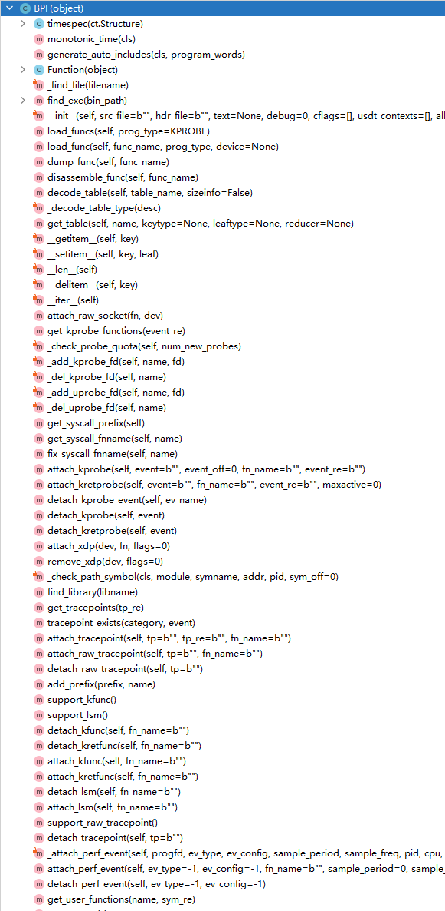
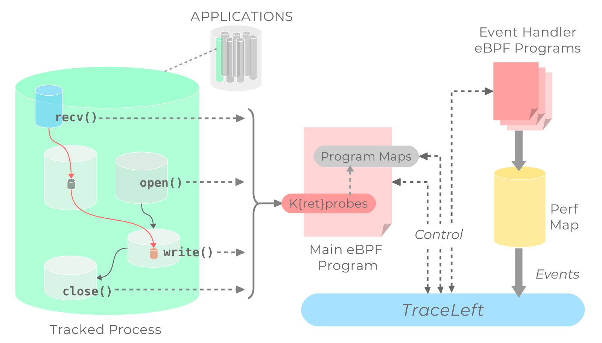
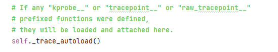

# 实例化BPF类


```
from bcc import BPF

BPF(text='int kprobe__sys_clone(void *ctx) { bpf_trace_printk("Hello, World!\\n"); return 0; }').trace_print()
```





核心类BPF位于src/python/bcc/__init__.py，类结构很长






可以拆分为两部分，一部分是BPF实例化，另一部分时调用trace_print()函数

```

BPF(text='int kprobe__sys_clone(void *ctx) { bpf_trace_printk("Hello, World!\\n"); return 0; }').trace_print()

等价于

b = BPF(text='int kprobe__sys_clone(void *ctx) { bpf_trace_printk("Hello, World!\\n"); return 0; }')

b.trace_print()
```


关键点，会将text编译成ebpf虚拟机可执行代码，在放到虚拟机执行。bcc集成了编译器的工作。

```
......
from .libbcc import lib, _CB_TYPE, bcc_symbol, _SYM_CB_TYPE
......
class BPF(object):
......
    def __init__(self, src_file="", hdr_file="", text=None, cb=None, debug=0,
        cflags=[], usdt_contexts=[]):
        ......

        if text:
            self.module = lib.bpf_module_create_c_from_string(text.encode("ascii"),
            self.debug, cflags_array, len(cflags_array))
        else:
            ......

        self._trace_autoload()
```

加载c库，
```
lib = ct.CDLL("libbcc.so.0", use_errno=True)
```

加载c代码，编译在load_cfile中，调用 clang_loader.parse 解析


```
void * bpf_module_create_c_from_string(const char *text, unsigned flags, const char *cflags[],
                                       int ncflags, bool allow_rlimit, const char *dev_name) {
  auto mod = new ebpf::BPFModule(flags, nullptr, true, "", allow_rlimit, dev_name);
  if (mod->load_string(text, cflags, ncflags) != 0) {
    delete mod;
    return nullptr;
  }
  return mod;
}
```

```
// load a C text string
int BPFModule::load_string(const string &text, const char *cflags[], int ncflags) {
  if (!sections_.empty()) {
    fprintf(stderr, "Program already initialized\n");
    return -1;
  }
  if (int rc = load_cfile(text, true, cflags, ncflags))
    return rc;
  if (rw_engine_enabled_) {
    if (int rc = annotate())
      return rc;
  } else {
    annotate_light();
  }

  if (int rc = finalize())
    return rc;
  return 0;
}
```

```
// load an entire c file as a module
int BPFModule::load_cfile(const string &file, bool in_memory, const char *cflags[], int ncflags) {
  ClangLoader clang_loader(&*ctx_, flags_);
  if (clang_loader.parse(&mod_, *ts_, file, in_memory, cflags, ncflags, id_,
                         *func_src_, mod_src_, maps_ns_, fake_fd_map_, perf_events_))
    return -1;
  return 0;
}
```

最后在__init__最后一行进行代码加载，call系统调用执行编译好的程序

```
self._trace_autoload()
```


```
    def _trace_autoload(self):
        for i in range(0, lib.bpf_num_functions(self.module)):
            func_name = lib.bpf_function_name(self.module, i)
            if func_name.startswith(b"kprobe__"):
                fn = self.load_func(func_name, BPF.KPROBE)
                self.attach_kprobe(
                    event=self.fix_syscall_fnname(func_name[8:]),
                    fn_name=fn.name)
            elif func_name.startswith(b"kretprobe__"):
                fn = self.load_func(func_name, BPF.KPROBE)
                self.attach_kretprobe(
                    event=self.fix_syscall_fnname(func_name[11:]),
                    fn_name=fn.name)
            elif func_name.startswith(b"tracepoint__"):
                fn = self.load_func(func_name, BPF.TRACEPOINT)
                tp = fn.name[len(b"tracepoint__"):].replace(b"__", b":")
                self.attach_tracepoint(tp=tp, fn_name=fn.name)
            elif func_name.startswith(b"raw_tracepoint__"):
                fn = self.load_func(func_name, BPF.RAW_TRACEPOINT)
                tp = fn.name[len(b"raw_tracepoint__"):]
                self.attach_raw_tracepoint(tp=tp, fn_name=fn.name)
            elif func_name.startswith(b"kfunc__"):
                self.attach_kfunc(fn_name=func_name)
            elif func_name.startswith(b"kretfunc__"):
                self.attach_kretfunc(fn_name=func_name)
            elif func_name.startswith(b"lsm__"):
                self.attach_lsm(fn_name=func_name)
```


在_trace_autoload()做编译机加载，这里load_func其实就是各种检查，编译，之后attach到其他tracing中

何时调用到sys_bpf？
```
[__init__.py]self._trace_autoload() -> fn = [__init__.py]self.load_func(func_name, BPF.KPROBE) -> [__init__.py] lib.bcc_func_load -> [bpf_module.cc] int BPFModule::bcc_func_load -> [bpf_module.cc]ret = bcc_prog_load_xattr(&attr, prog_len, log_buf, log_buf_size, allow_rlimit_); -> [libbpf.c] ret = bpf_load_program_xattr(attr, attr_log_buf, attr_log_buf_size); -> [bpf.c] return libbpf__bpf_prog_load(&p); -> [bpf.c] fd = sys_bpf_prog_load(&attr, sizeof(attr)); -> [bpf.c] static inline int sys_bpf_prog_load(union bpf_attr *attr, unsigned int size)
```

最后，call sys_bpf，那么这个系统调用具体是什么功能？

```
static inline int sys_bpf_prog_load(union bpf_attr *attr, unsigned int size)
{
	int retries = 5;
	int fd;

	do {
		fd = sys_bpf(BPF_PROG_LOAD, attr, size);
	} while (fd < 0 && errno == EAGAIN && retries-- > 0);

	return fd;
}
```



之后，就是跟kprobe绑定，利用kprobe将寄存器虚拟机代码跑起来

```
    def attach_kprobe(self, event=b"", event_off=0, fn_name=b"", event_re=b""):
        event = _assert_is_bytes(event)
        fn_name = _assert_is_bytes(fn_name)
        event_re = _assert_is_bytes(event_re)

        # allow the caller to glob multiple functions together
        if event_re:
            matches = BPF.get_kprobe_functions(event_re)
            self._check_probe_quota(len(matches))
            for line in matches:
                try:
                    self.attach_kprobe(event=line, fn_name=fn_name)
                except:
                    pass
            return

        self._check_probe_quota(1)
        fn = self.load_func(fn_name, BPF.KPROBE)
        ev_name = b"p_" + event.replace(b"+", b"_").replace(b".", b"_")
        fd = lib.bpf_attach_kprobe(fn.fd, 0, ev_name, event, event_off, 0)
        if fd < 0:
            raise Exception("Failed to attach BPF program %s to kprobe %s" %
                            (fn_name, event))
        self._add_kprobe_fd(ev_name, fd)
        return self
```

这里bpf_attach_kprobe，bpf跟kprobe什么关系？？？这里能不能用别的？比如tracepoints？？



代码里可以get到，还有tracepoint、raw_tracepoint

早在eBPF出现之前, Linux内核就已经支持ftrace, perf, kprobes, uprobes, tracepoints, user-level statically defined tracing (USDT)等等, 通过这些机制, 可以动态监视甚至修改系统的状态。

和systemtap一样, eBPF并没有重新实现这些机制, 只是attach eBPF的代码到这些events上面, 收集相应的信息。

eBPF的主要贡献是提供了安全的环境来执行这些操作, 提供了一个寄存器虚拟机，高效且安全可靠执行，一个安全的环境是成熟解决方案的基础。

prog注入流程：

1. c代码控制逻辑通过llvm和clang编译成ebpf汇编程序
2. 通过bpf系统调用加载ebpf的prog到内核，对ebpf程序进行verfify，通过之后再JIT在线编译成本机可执行指令
3. 将JIT编译出的可执行程序关联到kprobe、tracepoint的hook上


```
int bpf_attach_kprobe(int progfd, enum bpf_probe_attach_type attach_type,
                      const char *ev_name, const char *fn_name,
                      uint64_t fn_offset, int maxactive)
{
  return bpf_attach_probe(progfd, attach_type,
                          ev_name, fn_name, "kprobe",
                          fn_offset, -1, maxactive, 0);
}
```

```
// config1 could be either kprobe_func or uprobe_path,
// see bpf_try_perf_event_open_with_probe().
static int bpf_attach_probe(int progfd, enum bpf_probe_attach_type attach_type,
                            const char *ev_name, const char *config1, const char* event_type,
                            uint64_t offset, pid_t pid, int maxactive,
                            uint32_t ref_ctr_offset)
{
  int kfd, pfd = -1;
  char buf[PATH_MAX], fname[256];
  bool is_kprobe = strncmp("kprobe", event_type, 6) == 0;

  if (maxactive <= 0)
    // Try create the [k,u]probe Perf Event with perf_event_open API.
    pfd = bpf_try_perf_event_open_with_probe(config1, offset, pid, event_type,
                                             attach_type != BPF_PROBE_ENTRY,
                                             ref_ctr_offset);

  // If failed, most likely Kernel doesn't support the perf_kprobe PMU
  // (e12f03d "perf/core: Implement the 'perf_kprobe' PMU") yet.
  // Try create the event using debugfs.
  if (pfd < 0) {
    if (create_probe_event(buf, ev_name, attach_type, config1, offset,
                           event_type, pid, maxactive) < 0)
      goto error;

    // If we're using maxactive, we need to check that the event was created
    // under the expected name.  If debugfs doesn't support maxactive yet
    // (kernel < 4.12), the event is created under a different name; we need to
    // delete that event and start again without maxactive.
    if (is_kprobe && maxactive > 0 && attach_type == BPF_PROBE_RETURN) {
      if (snprintf(fname, sizeof(fname), "%s/id", buf) >= sizeof(fname)) {
	fprintf(stderr, "filename (%s) is too long for buffer\n", buf);
	goto error;
      }
      if (access(fname, F_OK) == -1) {
        // Deleting kprobe event with incorrect name.
        kfd = open("/sys/kernel/debug/tracing/kprobe_events",
                   O_WRONLY | O_APPEND, 0);
        if (kfd < 0) {
          fprintf(stderr, "open(/sys/kernel/debug/tracing/kprobe_events): %s\n",
                  strerror(errno));
          return -1;
        }
        snprintf(fname, sizeof(fname), "-:kprobes/%s_0", ev_name);
        if (write(kfd, fname, strlen(fname)) < 0) {
          if (errno == ENOENT)
            fprintf(stderr, "cannot detach kprobe, probe entry may not exist\n");
          else
            fprintf(stderr, "cannot detach kprobe, %s\n", strerror(errno));
          close(kfd);
          goto error;
        }
        close(kfd);

        // Re-creating kprobe event without maxactive.
        if (create_probe_event(buf, ev_name, attach_type, config1,
                               offset, event_type, pid, 0) < 0)
          goto error;
      }
    }
  }
  // If perf_event_open succeeded, bpf_attach_tracing_event will use the created
  // Perf Event FD directly and buf would be empty and unused.
  // Otherwise it will read the event ID from the path in buf, create the
  // Perf Event event using that ID, and updated value of pfd.
  if (bpf_attach_tracing_event(progfd, buf, pid, &pfd) == 0)
    return pfd;

error:
  bpf_close_perf_event_fd(pfd);
  return -1;
}

```


---
