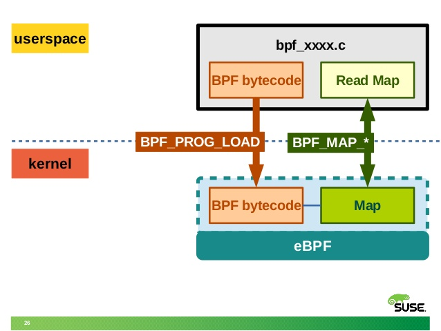
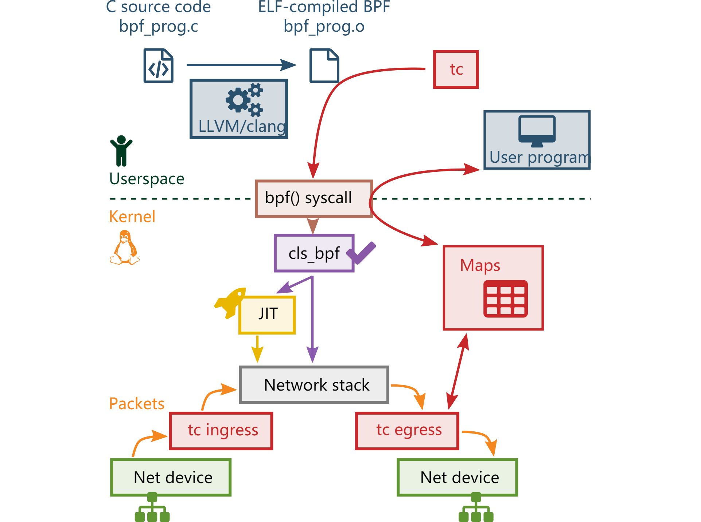

# 获取hashtab源码

问题：BPF实例化后，是如何访问到 bcc.table.HashTable 的？

代码：

```
b = BPF(text=bpf_program)

ipv4_send_bytes = b["ipv4_send_bytes"]

ipv4_recv_bytes = b["ipv4_recv_bytes"]
```

## 代码跟踪

实例化BPF之后，得到b，b的类型毫无疑问 ```<class 'bcc.BPF'>```
但是之后两行代码，直接将b作为字典来访问，这是如何做到的？？？

Python特性，**当我们对类的属性item进行下标的操作时，首先会被__getitem__()、__setitem__()、__delitem__()拦截，从而进行我们在方法中设定的操作，如赋值，修改内容，删除内容等等**。

dict魔术方法及作用：

```
__getitem__(self,key):返回键对应的值。

__setitem__(self,key,value)：设置给定键的值

__delitem__(self,key):删除给定键对应的元素。

__len__():返回元素的数量
```

毫无疑问，BPF类，复写了上述魔术方法，因此实例化话可以像字典一样访问对象的属性

源码位于 src/python/bcc/__init__.py

```
    def __getitem__(self, key):
        if key not in self.tables:
            self.tables[key] = self.get_table(key)
        return self.tables[key]

    def __setitem__(self, key, leaf):
        self.tables[key] = leaf

    def __len__(self):
        return len(self.tables)

    def __delitem__(self, key):
        del self.tables[key]

    def __iter__(self):
        return self.tables.__iter__()
```

但是，如果你是这么获取所有hash表，

```
b = BPF(text=bpf_program)

print( list(b.tables.keys()) )

ipv4_send_bytes = b["ipv4_send_bytes"]

ipv4_recv_bytes = b["ipv4_recv_bytes"]

print( list(b.tables.keys()) )

```

结果是这样的

```
[]
['ipv4_send_bytes', 'ipv4_recv_bytes']
```

因为需要给定键，如果没有会调用get_table获取，写入到```self.tables```中

```
if key not in self.tables:
            self.tables[key] = self.get_table(key)
        return self.tables[key]
```

这里bcc用户态是如何get到ebpf map中的hashtable呢？

```
    def get_table(self, name, keytype=None, leaftype=None, reducer=None):
        name = _assert_is_bytes(name)
        map_id = lib.bpf_table_id(self.module, name)
        map_fd = lib.bpf_table_fd(self.module, name)
        is_queuestack = lib.bpf_table_type_id(self.module, map_id) in [BPF_MAP_TYPE_QUEUE, BPF_MAP_TYPE_STACK]
        if map_fd < 0:
            raise KeyError
        if not keytype and not is_queuestack:
            key_desc = lib.bpf_table_key_desc(self.module, name).decode("utf-8")
            if not key_desc:
                raise Exception("Failed to load BPF Table %s key desc" % name)
            keytype = BPF._decode_table_type(json.loads(key_desc))
        if not leaftype:
            leaf_desc = lib.bpf_table_leaf_desc(self.module, name).decode("utf-8")
            if not leaf_desc:
                raise Exception("Failed to load BPF Table %s leaf desc" % name)
            leaftype = BPF._decode_table_type(json.loads(leaf_desc))
        return Table(self, map_id, map_fd, keytype, leaftype, name, reducer=reducer)
```

这里lib就是调用c库，```lib = ct.CDLL("libbcc.so.0", use_errno=True)```

前提需要知道，ebpf 使用 map与用户空间交互数据，将追踪到的信息放到map中，用户态从map获取





src/cc/bcc_common.cc

```
int bpf_table_fd(void *program, const char *table_name) {
  auto mod = static_cast<ebpf::BPFModule *>(program);
  if (!mod) return -1;
  return mod->table_fd(table_name);
}
```

最终返回Table，Table是有多种类型的，那么具体是什么类型，不同类型什么区别？
你需要知道，这个类型时ebpf定义的map类型，python用户态需要指定对应类型，能做啥操作，作为map消费者来处理对应的map

```
def Table(bpf, map_id, map_fd, keytype, leaftype, name, **kwargs):
    """Table(bpf, map_id, map_fd, keytype, leaftype, **kwargs)

    Create a python object out of a reference to a bpf table handle"""

    ttype = lib.bpf_table_type_id(bpf.module, map_id)
    t = None
    if ttype == BPF_MAP_TYPE_HASH:
        t = HashTable(bpf, map_id, map_fd, keytype, leaftype)
    elif ttype == BPF_MAP_TYPE_ARRAY:
        t = Array(bpf, map_id, map_fd, keytype, leaftype)
    elif ttype == BPF_MAP_TYPE_PROG_ARRAY:
        t = ProgArray(bpf, map_id, map_fd, keytype, leaftype)
    elif ttype == BPF_MAP_TYPE_PERF_EVENT_ARRAY:
        t = PerfEventArray(bpf, map_id, map_fd, keytype, leaftype, name)
    elif ttype == BPF_MAP_TYPE_PERCPU_HASH:
        t = PerCpuHash(bpf, map_id, map_fd, keytype, leaftype, **kwargs)
    elif ttype == BPF_MAP_TYPE_PERCPU_ARRAY:
        t = PerCpuArray(bpf, map_id, map_fd, keytype, leaftype, **kwargs)
    elif ttype == BPF_MAP_TYPE_LPM_TRIE:
        t = LpmTrie(bpf, map_id, map_fd, keytype, leaftype)
    elif ttype == BPF_MAP_TYPE_STACK_TRACE:
        t = StackTrace(bpf, map_id, map_fd, keytype, leaftype)
    elif ttype == BPF_MAP_TYPE_LRU_HASH:
        t = LruHash(bpf, map_id, map_fd, keytype, leaftype)
    elif ttype == BPF_MAP_TYPE_LRU_PERCPU_HASH:
        t = LruPerCpuHash(bpf, map_id, map_fd, keytype, leaftype)
    elif ttype == BPF_MAP_TYPE_CGROUP_ARRAY:
        t = CgroupArray(bpf, map_id, map_fd, keytype, leaftype)
    elif ttype == BPF_MAP_TYPE_DEVMAP:
        t = DevMap(bpf, map_id, map_fd, keytype, leaftype)
    elif ttype == BPF_MAP_TYPE_CPUMAP:
        t = CpuMap(bpf, map_id, map_fd, keytype, leaftype)
    elif ttype == BPF_MAP_TYPE_XSKMAP:
        t = XskMap(bpf, map_id, map_fd, keytype, leaftype)
    elif ttype == BPF_MAP_TYPE_ARRAY_OF_MAPS:
        t = MapInMapArray(bpf, map_id, map_fd, keytype, leaftype)
    elif ttype == BPF_MAP_TYPE_HASH_OF_MAPS:
        t = MapInMapHash(bpf, map_id, map_fd, keytype, leaftype)
    elif ttype == BPF_MAP_TYPE_QUEUE or ttype == BPF_MAP_TYPE_STACK:
        t = QueueStack(bpf, map_id, map_fd, leaftype)
    elif ttype == BPF_MAP_TYPE_RINGBUF:
        t = RingBuf(bpf, map_id, map_fd, keytype, leaftype, name)
    if t == None:
        raise Exception("Unknown table type %d" % ttype)
    return t
```

这个定义于内核中ebpf type类型需要匹配

include/uapi/linux/bpf.h

```
enum bpf_map_type {
	BPF_MAP_TYPE_UNSPEC,
	BPF_MAP_TYPE_HASH,
	BPF_MAP_TYPE_ARRAY,
	BPF_MAP_TYPE_PROG_ARRAY,
	BPF_MAP_TYPE_PERF_EVENT_ARRAY,
	BPF_MAP_TYPE_PERCPU_HASH,
	BPF_MAP_TYPE_PERCPU_ARRAY,
	BPF_MAP_TYPE_STACK_TRACE,
	BPF_MAP_TYPE_CGROUP_ARRAY,
	BPF_MAP_TYPE_LRU_HASH,
	BPF_MAP_TYPE_LRU_PERCPU_HASH,
	BPF_MAP_TYPE_LPM_TRIE,
	BPF_MAP_TYPE_ARRAY_OF_MAPS,
	BPF_MAP_TYPE_HASH_OF_MAPS,
	BPF_MAP_TYPE_DEVMAP,
	BPF_MAP_TYPE_SOCKMAP,
	BPF_MAP_TYPE_CPUMAP,
	BPF_MAP_TYPE_XSKMAP,
	BPF_MAP_TYPE_SOCKHASH,
	BPF_MAP_TYPE_CGROUP_STORAGE,
	BPF_MAP_TYPE_REUSEPORT_SOCKARRAY,
	BPF_MAP_TYPE_PERCPU_CGROUP_STORAGE,
	BPF_MAP_TYPE_QUEUE,
	BPF_MAP_TYPE_STACK,
	BPF_MAP_TYPE_SK_STORAGE,
	BPF_MAP_TYPE_DEVMAP_HASH,
	BPF_MAP_TYPE_STRUCT_OPS,
	BPF_MAP_TYPE_RINGBUF,
	BPF_MAP_TYPE_INODE_STORAGE,
	BPF_MAP_TYPE_TASK_STORAGE,
};
```

eBPF-map 类型:

```
BPF_MAP_TYPE_UNSPEC
BPF_MAP_TYPE_HASH  eBPF-maps hash表，是主要用的前两种方式之一
BPF_MAP_TYPE_ARRAY 和上面类似，除了索引像数组一样
BPF_MAP_TYPE_PROG_ARRAY 将加载的eBPF程序的文件描述符保存其值，常用的是使用数字识别不同的eBPF程序类型，也可以从一个给定key值的eBPF-maps找到eBPF程序，并且跳转到程序中去
BPF_MAP_TYPE_PERF_EVENT_ARRAY 配合perf工具，CPU性能计数器，tracepoints，kprobes和uprobes。可以查看路径samples/bpf/下的tracex6_kern.c，tracex6_user.c，tracex6_kern.c，tracex6_user.c
BPF_MAP_TYPE_PERCPU_HASH 和BPF_MAP_TYPE_HASH一样，除了是为每个CPU创建
BPF_MAP_TYPE_PERCPU_ARRAY 和BPF_MAP_TYPE_ARRAY一样，除了是为每个CPU创建
BPF_MAP_TYPE_STACK_TRACE 用于存储stack-traces
BPF_MAP_TYPE_CGROUP_ARRAY 检查skb的croup归属
BPF_MAP_TYPE_LRU_HASH
BPF_MAP_TYPE_LRU_PERCPU_HASH
BPF_MAP_TYPE_LPM_TRIE 最专业的用法，LPM(Longest Prefix Match)的一种trie
BPF_MAP_TYPE_ARRAY_OF_MAPS 可能是针对每个port的
BPF_MAP_TYPE_HASH_OF_MAPS 可能是针对每个port的
BPF_MAP_TYPE_DEVMAP 可能是定向报文到dev的
BPF_MAP_TYPE_SOCKMAP 可能是连接socket的
```


---
